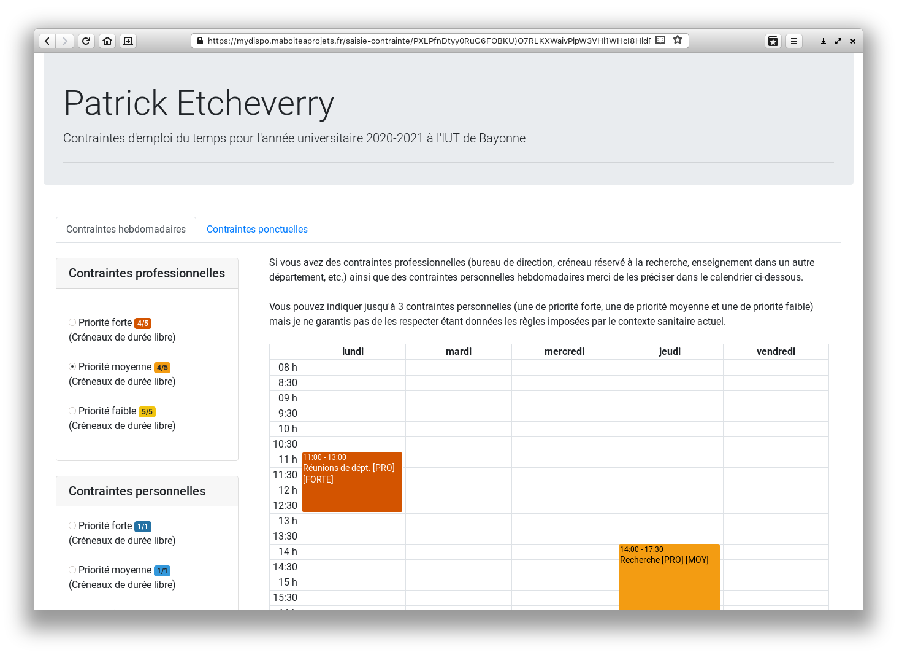

# MyDispo
Projet DUT 2ème année développé par Hugo Labastie et Thomas Bouchet.
Application web destinée à reccueillir des contraintes et disponibilités des enseignants afin de faciliter la création des EDT.

